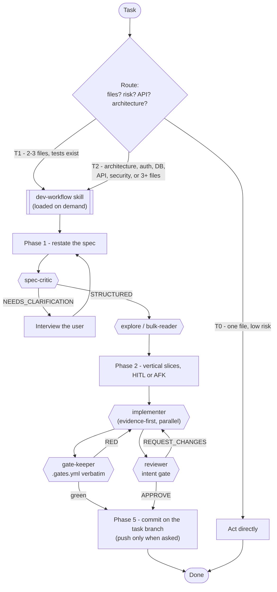

# agent-workflow

Versioned, copy-paste kit for a multi-agent development workflow with **Claude Code**
(opencode support unmaintained): task routing, agent roster, token-shunt hook, enforceable gates.

## Why

- **Route before working.** A typo must not pay for a spec, a critic and two gate runs.
- **Load rules on demand.** `AGENTS.md` ~600 tokens, always on. The five phases ~4500,
  only when routed T1/T2.
- **Cheap models read, the expensive one decides.** The shunt hook redirects large reads
  to subagents; reasoning stays on the primary model.
- **Two gates.** `.gates.yml` proves the code runs; the reviewer proves it does what was
  asked. Green tests on the wrong feature is a failed task.
- **Evidence before code.** Every brief names its proof form (TDD, suite green, manual QA).
- **Gates are data, not prompts.** `.gates.yml` runs verbatim in CI and under an agent
  that never interprets results.

## Workflow



| Level | Trigger | Process |
|---|---|---|
| **T0** | 1 file, low risk, no API surface | act directly |
| **T1** | 2-3 files, existing tests prove it | `dev-workflow` skill |
| **T2** | architecture, auth, DB, API, security, or 3+ files with new behavior | `dev-workflow` skill |

In doubt, route one level up. Routing lives in `AGENTS.md`, phases in
`.claude/skills/dev-workflow/SKILL.md`.

## Install

Two ways to deploy the kit — pick one per machine, they aren't mutually exclusive with
other projects running the other mode.

### Per-project

Isolated, versioned with the project; safe default when different projects need
different agent tuning or workflow revisions.

```powershell
Copy-Item -Recurse AGENTS.md, CLAUDE.md, .gates.yml, .claude, .opencode /path/to/project/
```

### Global (one copy, every session, any project)

Symlinks need admin on Windows (tested twice: PowerShell `New-Item -ItemType
SymbolicLink` and Git Bash `ln -s` with `MSYS=winsymlinks:nativestrict` both fail
without elevation; plain `ln -s` silently falls back to a copy, not a link). Until that
trade-off is settled, plain shims — no elevation needed:

```powershell
$REPO = 'C:/path/to/agent-workflow'   # this repo, cloned once
New-Item -ItemType Directory -Force ~/.claude/hooks, ~/.claude/skills/dev-workflow, ~/.claude/agents | Out-Null

# AGENTS.md: one-line native import
Set-Content ~/.claude/AGENTS.md "@$REPO/AGENTS.md"

# shunt hook + statusline: one-line call shims (hooks run as scripts, @import doesn't apply)
foreach ($s in 'hooks/shunt.ps1', 'statusline-command.ps1') {
    Set-Content ~/.claude/$s "& '$REPO/.claude/$s' @args; exit `$LASTEXITCODE"
}

# dev-workflow skill: one-line pointer shim (skills don't support @import either)
Set-Content ~/.claude/skills/dev-workflow/SKILL.md @"
---
name: dev-workflow
description: Multi-phase development workflow (spec, plan, implement, verify gates, git, multi-agent orchestration) for T1/T2 tasks — substantial features, refactors, or anything touching architecture, auth, DB, or a public API surface. Use when a task is routed T1 or T2 per AGENTS.md task-routing criteria, or when the user asks to "follow the workflow" / "orchestrate this".
---

Shim — source of truth is the agent-workflow repo. Do not edit this copy;
edit .claude/skills/dev-workflow/SKILL.md in the repo instead.

Read and follow exactly:
$REPO/.claude/skills/dev-workflow/SKILL.md

Its sibling files (gates.md, ui.md, metrics.md) sit next to that repo file,
not next to this shim; read them from $REPO too, when their trigger applies.
"@

# agent roster: no pointer mechanism available — plain synced copies
Copy-Item "$REPO/.claude/agents/*.md" ~/.claude/agents/
```

Wire the shims in `~/.claude/settings.json`, absolute forward-slash paths (hook shell
varies):

```json
"hooks": { "PreToolUse": [ { "matcher": "Read|Bash", "hooks": [
  { "type": "command", "command": "pwsh -NoProfile -File C:/Users/<you>/.claude/hooks/shunt.ps1", "timeout": 10 } ] } ] },
"statusLine": { "type": "command", "command": "pwsh -NoProfile -File C:/Users/<you>/.claude/statusline-command.ps1" }
```

Re-run the last `Copy-Item` whenever `.claude/agents/*.md` changes in the repo — nothing
detects drift automatically:

```powershell
Get-ChildItem "$REPO/.claude/agents/*.md" | Where-Object {
    (Get-FileHash $_).Hash -ne (Get-FileHash "~/.claude/agents/$($_.Name)" -ErrorAction SilentlyContinue).Hash
} | Select-Object -ExpandProperty Name
```

Restart any running Claude Code session after first-time setup — it only detects a new
`~/.claude/agents/` directory at session start.

This repo itself uses its own kit (auto-dogfooding), in global mode. Beyond the kit it
carries `githooks/` and `.gates.yml` for its own self-gate (wired with
`git config core.hooksPath githooks` here only); projects may mirror the gate pattern
with their own `.gates.yml` + pre-commit, but they are not part of the copy.

## Layout

```
AGENTS.md                  routing + shunt rules, always loaded. CLAUDE.md = one line @AGENTS.md
.claude/settings.json      permissions, hooks, statusLine       settings.local.json  never committed
.claude/statusline-command.ps1  referenced by settings.json
.claude/hooks/              shunt.ps1 (PreToolUse), session-end.ps1 (usage import), shunt.Tests.ps1
.claude/agents/             implementer reviewer gate-keeper explore bulk-reader code-writer spec-critic
.claude/skills/dev-workflow/ 5-phase workflow + multi-agent rules, loaded on demand for T1/T2; gates.md, ui.md, metrics.md read only when triggered
.opencode/                  unmaintained: roster, shunt.ts, usage-log.ts, bun tests; outside gates and CI
scripts/run-gates.ps1       executes .gates.yml (gate-keeper + CI)
scripts/review-checklist.ps1 per-file checklist fed to the reviewer
scripts/{usage-report,usage-import-claude,session-tools,shunt-report}.ps1   cost + telemetry
.gates.yml                  lint / typecheck / build / test / sast / format
PSScriptAnalyzerSettings.psd1 lint rules for the .ps1 gate
.github/ githooks/          this repo's own CI and self-gate, not shipped to projects
```

## Gates

- `.gates.yml` at every project root is the single source of gate commands (format
  documented in `.claude/skills/dev-workflow/gates.md`); `gate-keeper` runs it verbatim.
  Missing file -> built with the user, never guessed.
- A generated skeleton emits unfillable gates as hard reds
  (`echo "gate not configured" >&2 && exit 1`). A green run proving nothing is worse than none.
- SAST is non-skippable. A run without it is a red gate. Missing tool = FAIL, never skip.
- Local-only by default; CI optional. Long tasks persist state in `docs/tasks/<slug>.md`.
- This repo self-gates: `git config core.hooksPath githooks` (PSScriptAnalyzer, secrets,
  accents, JSON, `CLAUDE.md == @AGENTS.md`); `githooks/pre-commit` is a sh shim to
  `pre-commit.ps1`.

## Per-project overrides

Same-name file in the project: `.claude/agents/<name>.md` or `.opencode/agent/<id>.md`
(opencode merges: scalars replaced, permission rules appended). Kit definition is the
base; the project file adds stack specifics.

## Dependencies

| Tool | Needed by | Notes |
|---|---|---|
| PowerShell 7.5+ (`pwsh`) | hooks, statusline, scripts, gates | `winget install Microsoft.PowerShell` |
| PSScriptAnalyzer 1.25.0, Pester 6.2.0 | lint + test gates, self-gate | `Install-Module <name> -RequiredVersion <v> -Scope CurrentUser` |
| `gitleaks` | sast gate, self-gate | missing gate tool = hard red |
| `bun` | opencode plugins only (unmaintained) | `bun install` in `.opencode/` |

Paths in `settings.json` are relative to the project root.

## Cross-tool parity

- **Shunt**: `shunt.ts` (opencode) and `shunt.ps1` (Claude), same thresholds - 350 lines /
  65536 bytes, tunable with `SHUNT_MIN_LINES` / `SHUNT_MAX_BYTES`. Divergences: exactly
  350 lines passes on the Claude side (counts `\n`), blocked on the opencode side (counts the
  trailing newline); `verb/foo.txt` with no trailing space is blocked opencode-side only.
  Claude flags subagent calls with a top-level `agent_id`. MSYS drive paths (`/c/...`) in
  Bash-tool commands resolve to `C:\...`. Test: `Invoke-Pester .claude/hooks/shunt.Tests.ps1`.
- **Skills**: no opencode copy needed - it discovers `.claude/skills/*/SKILL.md` natively.
- **Telemetry**: every shunt decision (allow and deny) appends one JSONL line to
  `.usage/shunt.jsonl`. Schema: `ts` `harness` `session` `tool` `decision` `reason` `path`
  `bytes` `lines` `threshold_bytes` `threshold_lines`, plus `command` (bash) or
  `offset`/`limit` (read); records with no `decision` are legacy denies. One record per
  file arg. Best-effort: a write failure never blocks the redirect. Aggregate with
  `scripts/shunt-report.ps1`. Never rotated - purge with `Remove-Item .usage/shunt.jsonl`.
- **Accepted divergences**: `hidden`/`temperature` opencode-only; `effort` Claude-only, so
  model tiers are set independently; detailed permissions opencode-only; `git push` ask is
  a permission rule (Claude) vs a `permission` field (opencode).
- `.claude/settings.json` is versioned without secrets (credentials live in
  `.claude/settings.local.json`, never committed).
- `.opencode/settings.local.json` is also machine-local and never committed.

This repo runs its own kit in global mode.

## License

MIT - see `LICENSE`.
